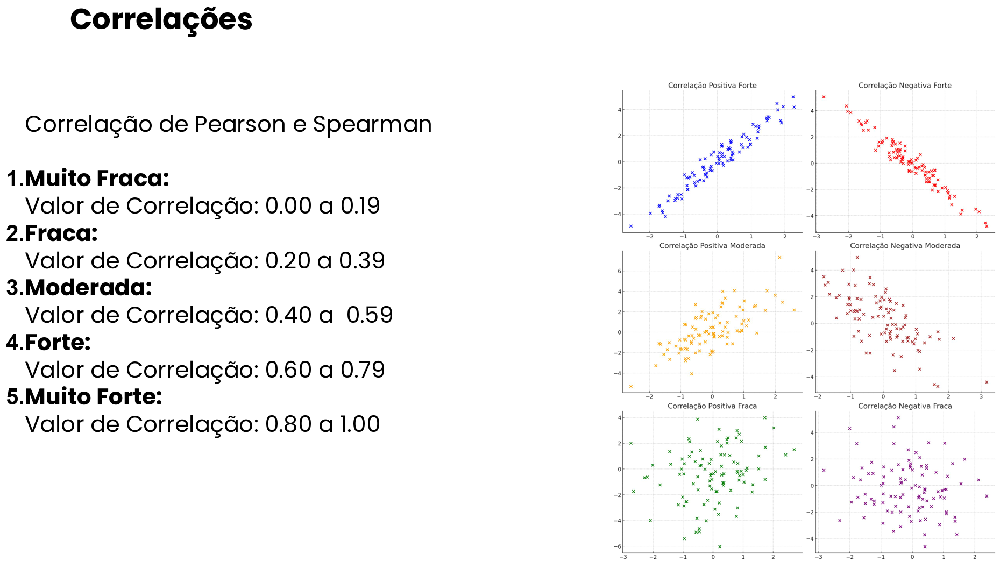

# Estatística com python

## Explicação dos arquivos presentes nesta pasta
- **estatistica_basica.py:**
Script voltado para relembrar conceitos básicos de estatística e ilustrar o uso
de pandas e numpy
- **correlacao_dados.py:**
Script focado em métodos para verificar correlação de variáveis
- **clientes-v3-preparado.csv:** 
Arquivo CSV com os dados preparados para utilização nas aulas como objeto de estudo

## Correlação entre variáveis
Duas variáveis podem se correlacionar de maneira positiva ou negativa (enquanto
uma cresce a outra cresce ou diminui) e essa relação pode ser forte ou fraca,
gerando uma representação gráfica de reta quando é forte ou uma disperção
quando é fraca.

