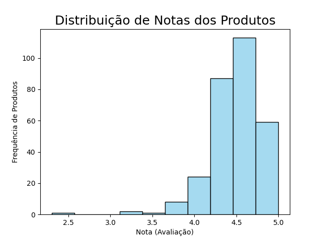
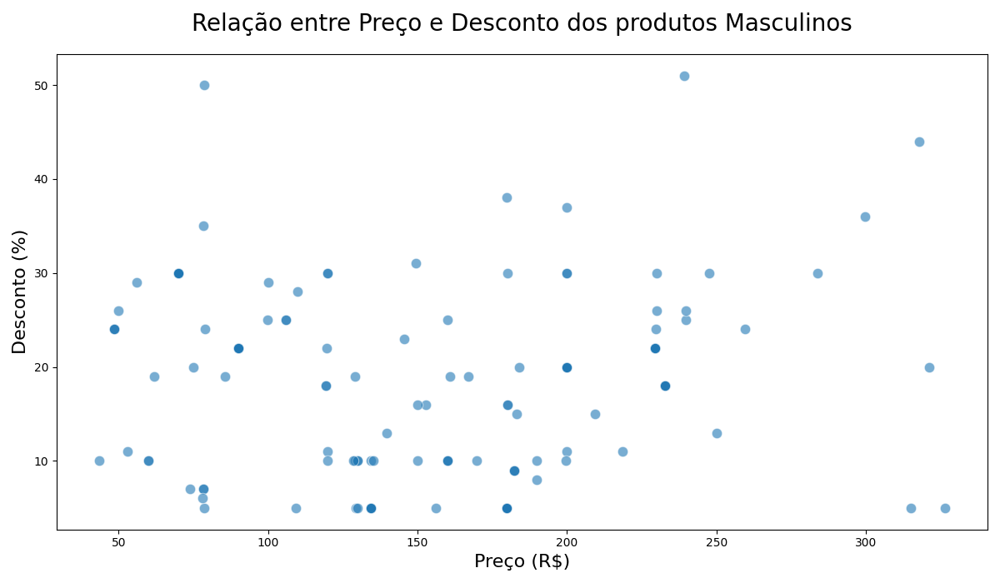
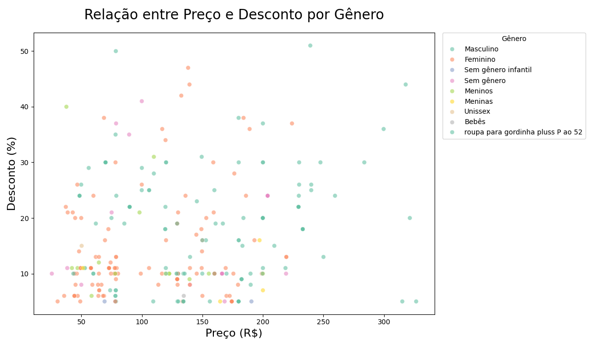
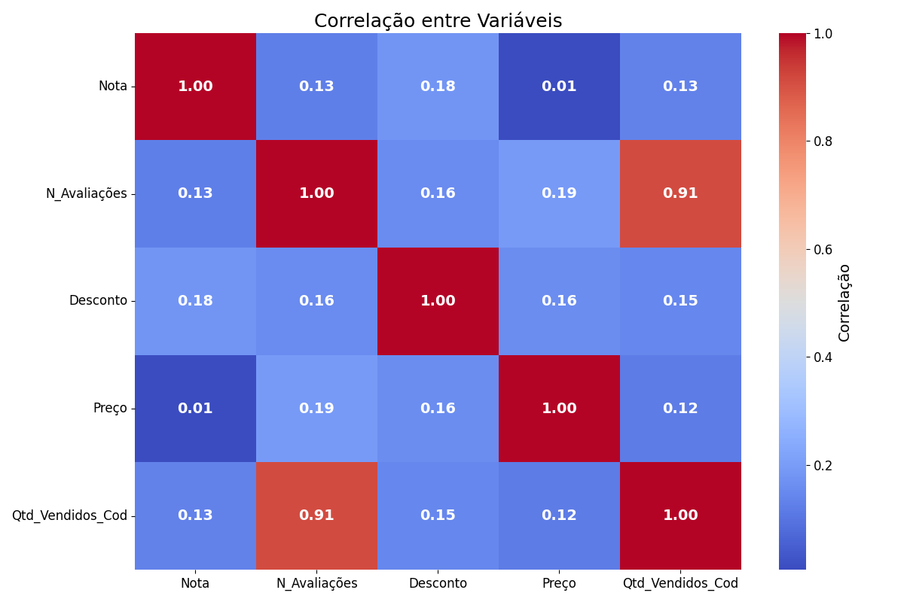
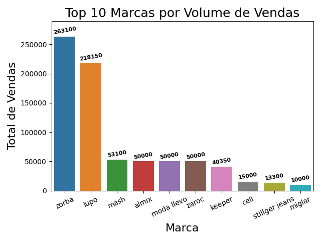
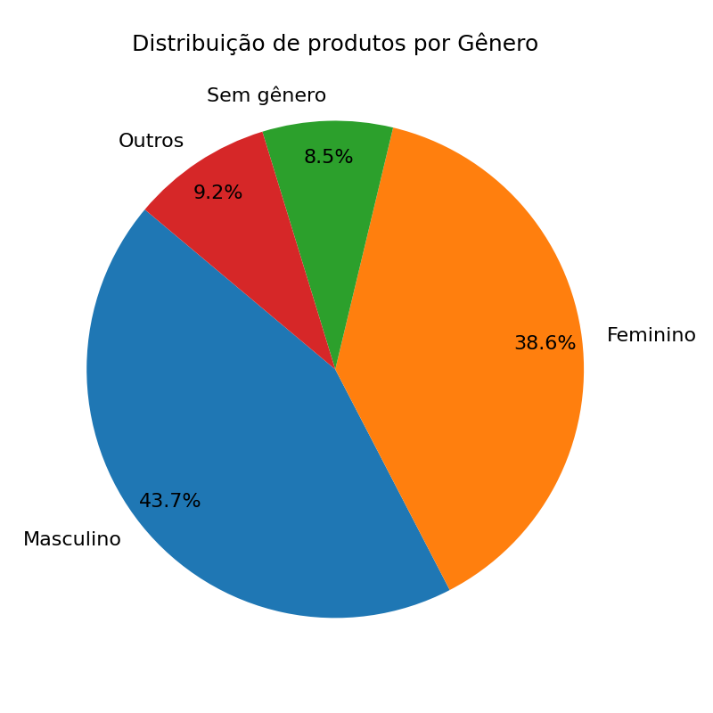
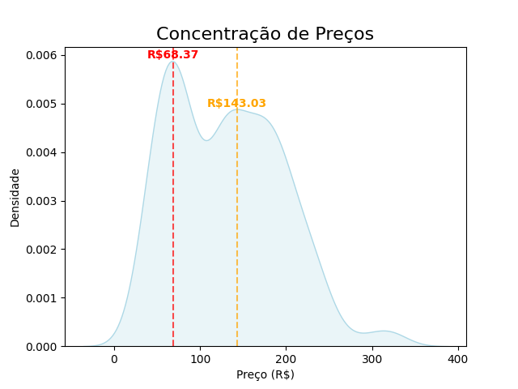
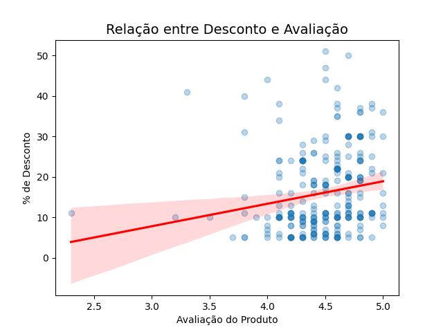

# Exercício do módulo 22

## Enunciado do exercício
Leia o arquivo ‘ecommerce_estatistica.csv’ dentro de um dataframe .
Faça uma análise detalhada dos dados, descubra quais dados gostaria de destacar e crie os seguintes gráficos:
- Gráfico de Histograma
- Gráfico de dispersão
- Mapa de calor
- Gráfico de barra
- Gráfico de pizza 
- Gráfico de densidade 
- Gráfico de Regressão

Adicione títulos nos gráficos e nos eixos para ficar claro os objetivos dos gráficos

## O que foi feito:
### Gráfico de Histograma
Foi feito para analisar a distribuição das notas dos produtos,
ficando claro uma concentração em torno da nota 4,5.

### Gráfico de Dispersão
O gráfico de dispersão foi utilizado para verificar a correlação
entre preço e desconto. Parece não haver correlação e é possível 
identificar alguns outliers que saltam da concentração dos dados.

Foram criados dois gráficos de dispersão: o acima que filtra por
apenas um gênero de produto e o abaixo que abrange todos os gêneros.
Contudo, o gráfico abaixo parece ser um pouco confuso pela grande 
quantidade de gêneros, sendo mais útil para ver o comportamento geral
dos dados e menos como uma referência visual do comportamento individual
de cada gênero.

### Mapa de Calor
O mapa de calor foi utilizado para verificar a correlação entre as
variáveis numéricas do conjunto de dados. Nota-se uma correlação forte
positiva apenas entre o Número de avaliações e a Quantidade de vendas.

### Gráfico de Barras
Utilizou-se o gráfico de barras para ilustrar as marcas que mais vendem,
destacando-se "Zorba" e "Lupo".

### Gráfico de Pizza
Com o objetivo de entender a distribuição de produtos entre os diferentes
gêneros, foi gerado um gráfico de pizza que ilustra o percentual da quantidade
de produtos cadastrados por gênero.

Para utilizar um gráfico de pizza é importante que não haja diversas
fatias pouco representativas, isso faz com que o gráfico fique difícil
de ler e interpretar. Para que isso não acontecesse, foi colocado um filtro
no qual as pequenas parcelas entrassem em uma mesma categoria de "Outras".

### Gráfico de Densidade
O gráfico de densidade ilustra a concentração na distribuição de uma determinada 
variável do conjunto de dados. Ou seja, com o gráfico de densidade aplicado sobre
os preços dos produtos, podemos observar uma concentração maior de produtos em
torno de dois valores: R\$68,37 e R\$143,03.

### Gráfico de Regressão
Este gráfico é utilizado para entender a tendência do comportamento de duas
variáveis do conjunto de dados. Aqui foi utilizado o gráfico de regressão 
para analisar a correlação entre desconto e nota. É possível notar que há
uma correlação positiva, o que significa que descontos maiores tendem a trazer
avaliações melhores

